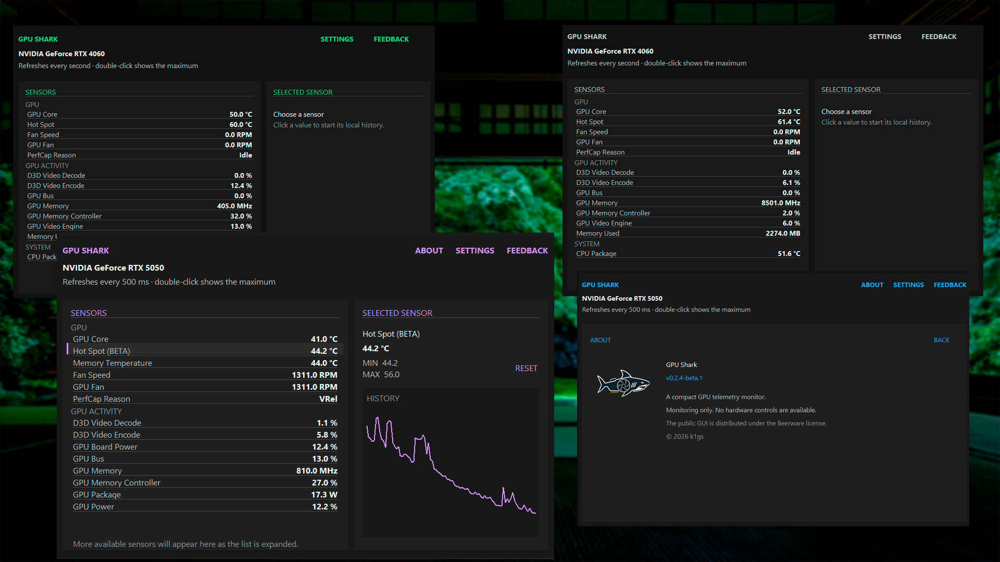
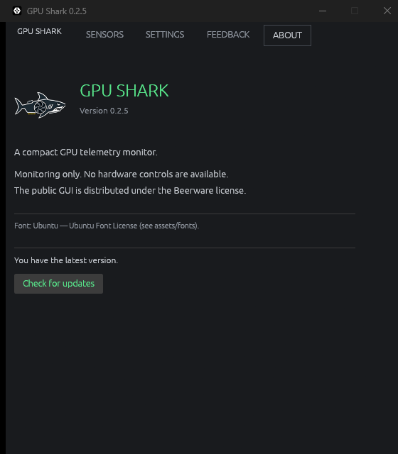

# GPU Shark

**A compact, native and honest NVIDIA telemetry monitor for Windows.**

[Download](#download) · [GPU support](#gpu-support) · [Roadmap](#roadmap) · [Build](#build-the-public-gui) · [Contribute](#contributing) · [Russian](https://github.com/k1gs/Gpu-Shark/blob/main/README_RU.md) 

> [!IMPORTANT]
> GPU Shark is strictly read-only. It does not change clocks, voltage, firmware
> or fan control, and it does not install a kernel driver.

GPU Shark is a lightweight Win32 application with no heavyweight GUI framework
and no silent background network telemetry. It shows only
measurements that the hardware and driver actually expose; unavailable sensors
stay hidden instead of being replaced with guessed values.[^sensor-availability]

## At a glance

| Native and lightweight | Honest telemetry | Useful during a test |
|---|---|---|
| Fast Win32 interface and a portable official single EXE | Core, HotSpot and VRAM are never substituted for one another | Live history, session maximums and GPU-Z-compatible PerfCap reasons |
| Compact live sensor dashboard | Exact enhanced thermal mappings are enabled only for validated PCI profiles | Separate fan, power, voltage, activity and system readings when exposed |

### Highlights

- GPU Core, HotSpot and VRAM temperatures when the hardware exposes them
- Decoded NVIDIA PerfCap reasons compatible with GPU-Z: <code>Pwr</code>,
  <code>Thrm</code>, <code>VRel</code>, <code>VOp</code>, <code>Idle</code>
  and <code>SLI</code>
- Separate fan RPM values on supported multi-fan boards
- GPU, board and source power and voltage sensors
- Live graph for the selected sensor
- Per-sensor maximum tracking, enabled by double-clicking a sensor row
- Persistent language, refresh interval and accent settings
- Localized About view with the project logo and application version
- Consent-based feedback form with no automatic submission
- Fixed landscape layout with flicker-free double-buffered drawing

### Native interface

  

The interface keeps the live readings, settings, About information and
consent-based feedback in one compact native Win32 application.

> [!NOTE]
> GPU Shark never invents a HotSpot value from Core, Memory or an unrelated
> sensor. Combined PerfCap reasons are shown together, unknown bits are labeled
> <code>Unknown</code>, and unsupported fields remain hidden.

## GPU support

The regular driver/provider path works with many NVIDIA GPUs, but the exact set
of visible sensors depends on the GPU, board design, driver and firmware.
Enhanced temperature support is deliberately tracked per validated device
profile.[^sensor-availability]

> [!WARNING]
> GeForce RTX 50-series HotSpot support is **beta**. The current verified
> enhanced native fallback profile is the desktop GeForce RTX 5050 (10DE:2D83);
> other RTX 50 cards use the conservative provider path until their exact
> hardware profiles are validated.
> GPU Shark marks any displayed RTX 50 HotSpot row as <code>BETA</code>. The
> label does not manufacture a missing reading.

| GPU | Core | HotSpot | VRAM temperature | Profile status |
|---|:---:|:---:|:---:|---|
| GeForce RTX 2060 SUPER | Yes | Validated | Board-dependent | Validated |
| GeForce RTX 2070 SUPER | Yes | Validated | Validated | Validated |
| GeForce RTX 3050 | Yes | Validated | Board-dependent | Validated |
| GeForce RTX 3060 | Yes | Validated | Board-dependent | Validated |
| GeForce RTX 3070 | Yes | Validated | Board-dependent | Validated |
| GeForce RTX 3080 | Yes | Validated | Validated | Validated |
| GeForce RTX 4060 | Yes | Validated | Board-dependent | Validated |
| GeForce RTX 4090 | Yes | Validated | Under validation | HotSpot validated |
| GeForce RTX 5050 | Yes | Beta[^rtx50] | Validated | Exact desktop profile |
| GeForce RTX 5070 | Yes | Beta[^rtx50] | Yes on tested board | Experimental |
| GeForce RTX 5070 Ti | Yes | Beta[^rtx50] | Yes on tested board | Experimental |
| Other NVIDIA GPUs | Usually | Driver/board-dependent | Driver/board-dependent | Conservative fallback |

See [SUPPORTED_GPUS.md](SUPPORTED_GPUS.md) for the user-facing support matrix.
If a measurement cannot be confirmed, GPU Shark leaves it unavailable.

## Roadmap

> [!TIP]
> The roadmap describes product direction, not a promise to ship unverified
> telemetry. Hardware support remains evidence-driven.

| Status | Direction |
|---|---|
| 🧪 Beta | Expand validated HotSpot telemetry for GeForce RTX 50-series cards; RTX 5050 is the first exact beta profile[^rtx50] |
| 🟡 In progress | Add more useful and correctly defined sensors |
| 🔵 Planned | Rework and polish the GUI |
| 🔵 Planned | Add Linux support |
| 🧪 Research | GPU Summary backed by a curated GPU database |
| 🔵 Planned | Flexible game/test overlay configuration and presentation |
| 🧪 Research | Built-in opt-in stress testing, including VRAM and memory-error checks[^stress-test] |
| Someday | Explore AMD GPU support after the NVIDIA experience and telemetry contracts are mature |

The immediate focus is the GUI polish pass, RTX 50 beta validation and expanding the
sensor model without weakening the read-only or privacy guarantees.

AMD GPU support is a long-term idea only: there is no active implementation or
release target for it yet.

## Download

1. Open the [releases page](https://github.com/k1gs/Gpu-Shark/releases).
2. Download <code>GPU-Shark-win-x64.zip</code> and
   <code>SHA256SUMS.txt</code> from the newest release.
3. Compare the archive SHA-256, unpack it and launch
   <code>GPU-Shark.exe</code>.
4. Accept the Windows administrator prompt required for read-only hardware
   access.

~~~powershell
(Get-FileHash .\GPU-Shark-win-x64.zip -Algorithm SHA256).Hash
~~~

The official package contains a standalone executable. Windows SmartScreen may
warn because the current binaries are not code-signed. Download only from this
repository and verify the published hash.

### Requirements

- Windows 10 or Windows 11, x64
- NVIDIA GPU with an installed display driver
- Administrator privileges for local hardware access

## Feedback and privacy

The application never sends a report automatically. Feedback is submitted only
after the user writes a message and explicitly accepts the consent option. A
report can contain the app version, selected interface language, detected GPU
name, currently displayed public sensors, a safe provider error, the user's
message and an optional reply address.

Reports do not include GPU UUIDs, serial numbers, computer name, Windows account
name or private hardware diagnostics.

> [!CAUTION]
> Do not attach private diagnostic dumps, proprietary NVIDIA material, API
> secrets or identity-bearing captures to public issues or pull requests.

## Build the public GUI

The public Rust/Win32 GUI source is in [gui-source/](gui-source/). The managed
and native telemetry-provider implementations are intentionally not published.
Matching public runtime DLLs are supplied through the
<code>GPU-Shark-gui-runtime-win-x64.zip</code> release asset.[^official-build]

### Prerequisites

- Stable Rust toolchain with <code>rustfmt</code>
- Visual Studio C++ Build Tools
- The runtime asset matching the GUI version

### Local build

1. Download the matching runtime asset and extract it.
2. Open PowerShell in <code>gui-source/</code>.
3. Configure a compatible feedback destination. The production destination is
   not stored in public source.
4. Format, test and build the GUI.
5. Build either an adjacent-runtime development package or a standalone EXE.

~~~powershell
$env:GPU_SHARK_FEEDBACK_HOST = "your-compatible-feedback-host"
$env:GPU_SHARK_FEEDBACK_PATH = "/your/api/path"

cargo fmt --check
cargo test
cargo build --release --locked

Copy-Item C:\path\to\runtime\*.dll .\target\release\
.\target\release\gpu-shark-gui.exe
~~~

For the official standalone layout, embed the verified runtime while building:

~~~powershell
$env:GPU_SHARK_EMBED_PUBLIC_RUNTIME = "1"
$env:GPU_SHARK_PUBLIC_PAYLOAD_DIR = "C:\path\to\verified-runtime"
cargo build --release --locked
~~~

The GUI loads <code>gs.dll</code> beside the executable and calls the small
public export <code>q</code> to receive one privacy-filtered JSON telemetry
snapshot. Runtime and GUI versions must match.

### GitHub Actions build

The [Build public GUI](.github/workflows/gui-build.yml) workflow formats,
checks and builds the GUI, downloads the matching runtime, verifies its
published SHA-256, embeds it and uploads a standalone single-EXE CI artifact.
The workflow has read-only repository permissions and cannot publish or modify
releases.

## Contributing

Small, focused pull requests are welcome. Keep implementation, documentation
and build changes in separate commits when practical.

### Branch and commit workflow

~~~powershell
git checkout -b feat/short-description

cargo fmt --check
cargo test
cargo check --locked

git add path\to\changed-file
git diff --cached
git commit -m "feat: describe the user-visible change"
git push -u origin feat/short-description
~~~

Open a pull request against <code>main</code> and explain:

- what changed and why;
- how it was tested;
- which GPU/driver was used for hardware-specific behavior;
- whether the change affects privacy, packaging or the public ABI.

| Prefix | Use it for |
|---|---|
| <code>feat:</code> | New user-visible functionality |
| <code>fix:</code> | Bug fixes and regressions |
| <code>docs:</code> | Documentation-only changes |
| <code>test:</code> | Test coverage and fixtures |
| <code>build:</code> | Build, packaging or CI changes |
| <code>refactor:</code> | Internal cleanup without a behavior change |

> [!WARNING]
> Never generalize a thermal mapping from one board to an entire GPU family.
> New HotSpot or VRAM mappings require an exact PCI profile and independent
> evidence. Do not publish private provider sources, private API identifiers,
> raw captures, debug symbols or local machine data.

## License

GPU Shark's original code and release binaries are available under the
[Beerware license](LICENSE). Third-party components retain their own licenses;
their notices are included in every binary/runtime release asset.

Bug reports are welcome through [GitHub Issues](https://github.com/k1gs/Gpu-Shark/issues).

[^sensor-availability]: Sensor availability varies between GPU chips, board
    partners, driver versions and firmware. A listed GPU model does not imply
    that every board exposes every measurement.
[^rtx50]: RTX 50 HotSpot support is beta and evidence-gated. The desktop RTX
    5050 10DE:2D83 profile has an independently validated native HotSpot
    fallback. Other RTX 50 cards do not receive a native HotSpot fallback
    until they have their own exact same-board evidence. If the regular
    provider exposes a HotSpot reading, GPU Shark displays it and marks the
    row <code>BETA</code>. Core or VRAM will never be relabeled as HotSpot.
[^stress-test]: Any future stress test must be explicitly started by the user
    and remain isolated from clocks, voltage, firmware and fan-control paths.
[^official-build]: Public source can build and audit the GUI and reproduce the
    standalone packaging against a checksum-verified released runtime. Provider
    DLL implementation source remains intentionally outside this repository.
