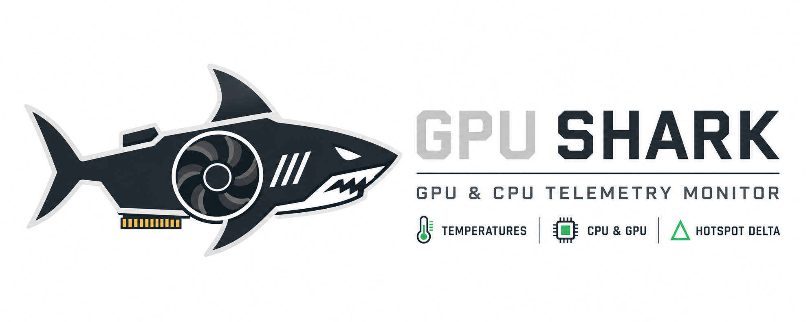
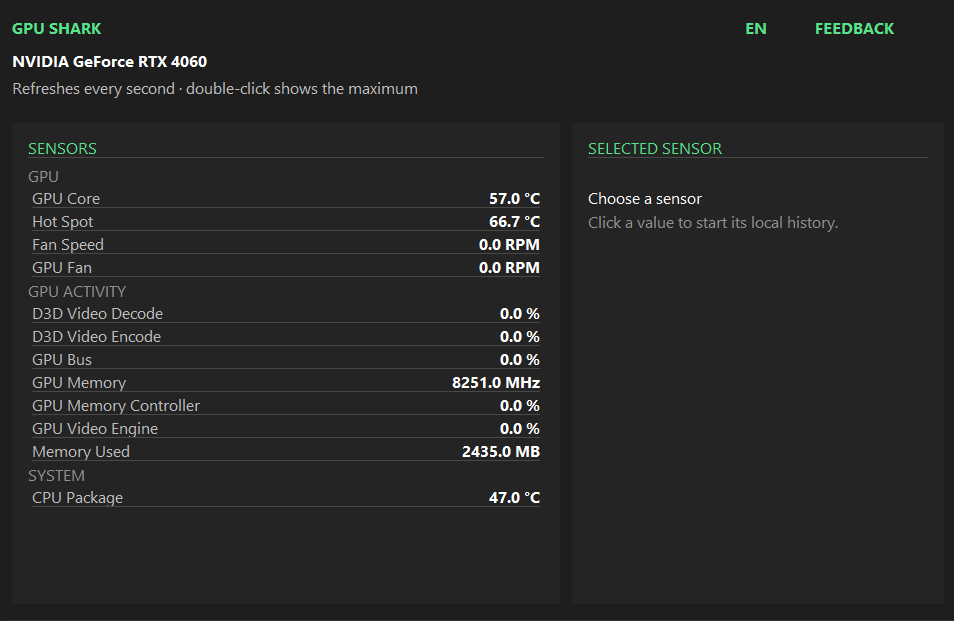

# GPU Shark



[](https://github.com/k1gs/Gpu-Shark/releases)
[](https://github.com/k1gs/Gpu-Shark/releases/latest)
[](LICENSE)

GPU Shark is a compact native Windows monitor for NVIDIA GPU and system
telemetry. The interface is a lightweight Win32 application: no browser engine,
no heavyweight GUI framework and no background hardware control.



## Highlights

- GPU Core, HotSpot and VRAM temperatures when the hardware exposes them
- Separate fan RPM values on supported multi-fan boards
- GPU, board and source power, voltage and performance-limit sensors
- Additional GPU and system sensors below the primary graphics-card group
- Live graph with a tighter scale for the selected sensor
- Per-sensor maximum tracking, enabled by double-clicking a sensor row
- Unavailable values are hidden instead of filling the interface with `N/A`
- Russian and English interface text
- Consent-based feedback form for unknown GPUs and provider failures
- Fixed landscape window with flicker-free double-buffered drawing

GPU Shark does not invent a HotSpot value from Core, Memory or an unrelated
sensor. Unsupported measurements remain unavailable.

## Download

1. Open the [releases page](https://github.com/k1gs/Gpu-Shark/releases).
2. Download `GPU-Shark-win-x64.zip` and `SHA256SUMS.txt` from the newest release.
3. Compare the archive SHA-256, unpack it and launch `GPU-Shark.exe`.
4. Accept the Windows administrator prompt required for read-only hardware
   access.

```powershell
(Get-FileHash .\GPU-Shark-win-x64.zip -Algorithm SHA256).Hash
```

The main package contains a standalone executable. Windows SmartScreen may warn
because the current binaries are not code-signed. Download only from this
repository and verify the published hash.

## Requirements

- Windows 10 or Windows 11, x64
- NVIDIA GPU and installed display driver
- Administrator privileges for local hardware access

GPU Shark is read-only. It does not change clocks, voltage, firmware or fan
control and does not install a kernel driver.

## Feedback and privacy

The application never sends a report automatically. The feedback form submits
only after the user writes a message and explicitly accepts the consent option.
A report can contain the app version, interface language, detected GPU name,
currently displayed public sensors, provider error, the user's message and an
optional reply address.

Reports do not include GPU identifiers, serial numbers, computer name, Windows
account name or internal hardware diagnostics. The production service address
is release-time configuration rather than public source configuration; desktop
network destinations should still be considered observable, so server-side
validation and rate limiting remain the security boundary.

## Build the public GUI

The public GUI source is in [`gui-source/`](gui-source/). The telemetry provider
implementation is not published. Matching prebuilt `gs.dll`, `gsn.dll` and any
required helper DLLs are supplied in the `GPU-Shark-gui-runtime-win-x64.zip`
release asset.

1. Install the stable Rust toolchain and Visual Studio C++ build tools.
2. Download the runtime asset matching the GUI version and extract its DLLs.
3. Open PowerShell in `gui-source/`.
4. Set a compatible feedback destination for your build. The repository does
   not contain the production destination.
5. Build and place the runtime DLLs beside the resulting executable.

```powershell
$env:GPU_SHARK_FEEDBACK_HOST = "your-compatible-feedback-host"
$env:GPU_SHARK_FEEDBACK_PATH = "/your/api/path"
cargo build --release
Copy-Item C:\path\to\runtime\*.dll .\target\release\
.\target\release\gpu-shark-gui.exe
```

The public ABI is intentionally small: the GUI loads `gs.dll` beside the
executable and calls export `q` to receive one JSON telemetry snapshot. Runtime
and GUI versions should match. See [`gui-source/README.md`](gui-source/README.md)
for the source-package notes.

## GPU support

Enhanced temperature support uses conservative per-device validation. Selected
RTX 20, RTX 30 and RTX 40 boards have validated profiles. RTX 50 support remains
under active validation; unknown HotSpot values stay unavailable.

See [SUPPORTED_GPUS.md](SUPPORTED_GPUS.md) for the current user-facing matrix.

## License

GPU Shark's original code and release binaries are available under the
[Beerware license](LICENSE). Third-party components retain their own licenses;
their notices are included in every binary/runtime release asset.

Bug reports are also welcome through [GitHub Issues](https://github.com/k1gs/Gpu-Shark/issues).
